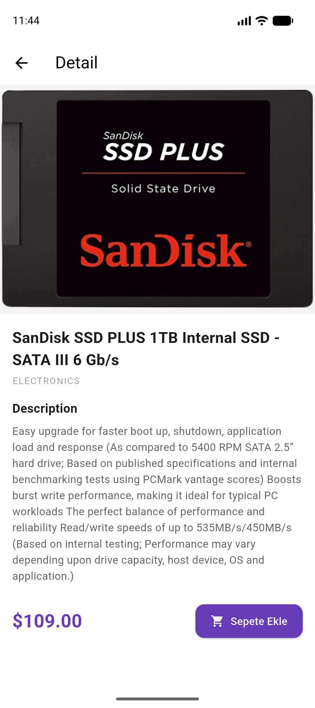
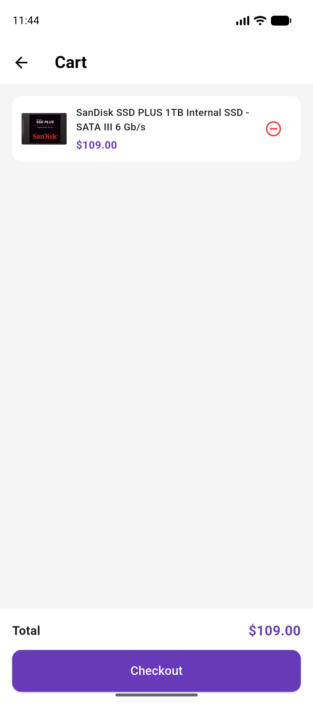

# Mini Katalog Uygulaması

Flutter ile geliştirilmiş basit bir ürün katalog uygulaması.

## Açıklama

Bu uygulama; ürün listeleme, ürün detayı görüntüleme ve sepet yönetimi özelliklerini içermektedir. Ürün verileri Fake Store API üzerinden çekilmektedir.

## Kullanılan Flutter Sürümü

Flutter 3.44.2

## Ekranlar

- Ana Sayfa (Discover) — GridView ile ürün listesi
- Ürün Detayı — Ürün bilgileri ve sepete ekle
- Sepet — Eklenen ürünler ve toplam fiyat

## Çalıştırma Adımları

1. Repoyu klonlayın:
git clone https://github.com/MuserrefEbruErden/mini-katalog.git
2. Proje dizinine girin:
cd mini-katalog
3. Bağımlılıkları yükleyin:
flutter pub get
4. Uygulamayı başlatın:
flutter run

## Ekran Görüntüleri

